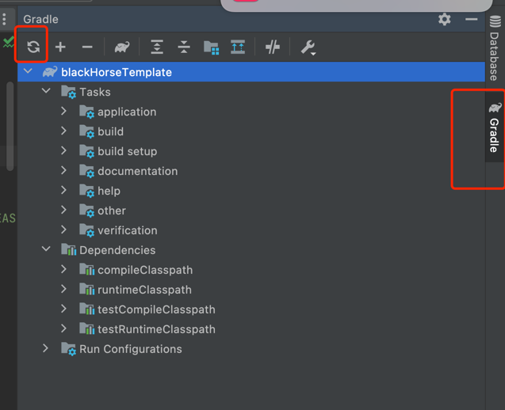

###1. (to run rabbitMQ locally for app)
docker run -d -p 5672:5672 -p 15672:15672 --name my-rabbit rabbitmq:3-management

blackHorse part:
1. gradle build first, like this 
2. after the refresh finished, right click on test Directory, then choose `Run Tests in blackHorse`
3. 
